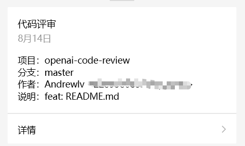
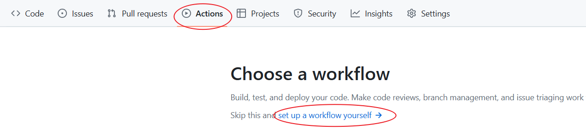

# 基于ChatGLM的自动代码评审组件

提交合并分支的代码，则触发代码评审，并写入评审日志文件。完成后发送公众号模板消息通知，点击<详情>查看评审细节。



## 使用方法
基于 GitHub Actions + ChatGLM + Git/GitHub + 公众号模板消息 串联出从代码提交获取通知，Git 检出分支变化，在使用 ChatGLM 进行代码和写入日志，再发送消息通知完成整个链路。

1. 申请ChatGLM
* CHATGLM_APIKEYSECRET： https://open.bigmodel.cn/usercenter/apikeys
* CHATGLM_APIHOST：https://open.bigmodel.cn/api/paas/v4/chat/completions

2. 申请 GitHub 仓库
* 工程库：https://github.com/xfg-studio-project/openai-code-review-test - 创建一个自己的，并提交代码。
* 日志库：https://github.com/xfg-studio-project/openai-code-review-log - 你创建一个自己的。
3. 申请 GitHub Token

地址：https://github.com/settings/tokens
创建后，保存生成的 Token，用于配置到 GitHub Actions 参数中
4. 微信公众号配置
* 申请地址 https://mp.weixin.qq.com/debug/cgi-bin/sandboxinfo?action=showinfo&t=sandbox/index
* 这个测试公众号等同于企业公众号，有对应的模板消息。
* 申请后，你就会获得 appID、appsecret、tourse - 就是谁关注了公众号，就会展示一个分配的微信号，推送模板消息就是给这个用户推送。
* 模板消息，自己新建一个。之后就获得ID。消息格式如下；
* ```
  项目：{{repo_name.DATA}} 分支：{{branch_name.DATA}} 作者：{{commit_author.DATA}} 说明：{{commit_message.DATA}}
  ```
5. GitHub Actions 配置

5.1 配置参数

地址：https://github.com/xfg-studio-project/openai-code-review-test/settings/secrets/actions - 换成你的项目工程，进入到 Setting -> Secrets and variables -> Actions -> Repository secrets -> New repository secret

| Name      | Secret                                                |
|-----------|-------------------------------------------------------|
| CHATGLM_APIHOST    | https://open.bigmodel.cn/api/paas/v4/chat/completions |
| CHATGLM_APIKEYSECRET | yours                                                 |
| CODE_REVIEW_LOG_URI | yours                                                 |
| CODE_TOKEN | yours                                                 |
| WEIXIN_APPID | yours                                                 |
| WEIXIN_SECRET | yours                                                 |
| WEIXIN_TEMPLATE_ID | yours                                                 |
| WEIXIN_TOUSER | yours                                                 |

5.2 配置脚本

```
name: Build and Run OpenAiCodeReview By Main Maven Jar

on:
  push:
    branches:
      - master
  pull_request:
    branches:
      - master

jobs:
  build:
    runs-on: ubuntu-latest

    steps:
      - name: Checkout repository
        uses: actions/checkout@v2
        with:
          fetch-depth: 2

      - name: Set up JDK 11
        uses: actions/setup-java@v2
        with:
          distribution: 'adopt'
          java-version: '11'

      - name: Create libs directory
        run: mkdir -p ./libs

      - name: Download openai-code-review-sdk JAR
        run: wget -O ./libs/openai-code-review-sdk-1.0.jar https://github.com/Andrewlv/openai-code-review-log/releases/download/v1.0/openai-code-review-sdk-1.0.jar

      - name: Get repository name
        id: repo-name
        run: echo "REPO_NAME=${GITHUB_REPOSITORY##*/}" >> $GITHUB_ENV

      - name: Get branch name
        id: branch-name
        run: echo "BRANCH_NAME=${GITHUB_REF#refs/heads/}" >> $GITHUB_ENV

      - name: Get commit author
        id: commit-author
        run: echo "COMMIT_AUTHOR=$(git log -1 --pretty=format:'%an <%ae>')" >> $GITHUB_ENV

      - name: Get commit message
        id: commit-message
        run: echo "COMMIT_MESSAGE=$(git log -1 --pretty=format:'%s')" >> $GITHUB_ENV

      - name: Print repository, branch name, commit author, and commit message
        run: |
          echo "Repository name is ${{ env.REPO_NAME }}"
          echo "Branch name is ${{ env.BRANCH_NAME }}"
          echo "Commit author is ${{ env.COMMIT_AUTHOR }}"
          echo "Commit message is ${{ env.COMMIT_MESSAGE }}"   

      - name: Run code Review
        run: java -jar ./libs/openai-code-review-sdk-1.0.jar
        env:
          GITHUB_REVIEW_LOG_URI: ${{ secrets.CODE_REVIEW_LOG_URI }}
          GITHUB_TOKEN: ${{ secrets.CODE_TOKEN }}
          COMMIT_PROJECT: ${{ env.REPO_NAME }}
          COMMIT_BRANCH: ${{ env.BRANCH_NAME }}
          COMMIT_AUTHOR: ${{ env.COMMIT_AUTHOR }}
          COMMIT_MESSAGE: ${{ env.COMMIT_MESSAGE }}

          WEIXIN_APPID: ${{ secrets.WEIXIN_APPID }}
          WEIXIN_SECRET: ${{ secrets.WEIXIN_SECRET }}
          WEIXIN_TOUSER: ${{ secrets.WEIXIN_TOUSER }}
          WEIXIN_TEMPLATE_ID: ${{ secrets.WEIXIN_TEMPLATE_ID }}

          CHATGLM_APIHOST: ${{ secrets.CHATGLM_APIHOST }}
          CHATGLM_APIKEYSECRET: ${{ secrets.CHATGLM_APIKEYSECRET }}


```


把以上脚本粘贴到你的 GitHub Actions 中，之后保存。
接下来你提交代码就会自动触发代码评审啦。💐 赶紧玩一下吧！看看智能的AI评审能力！